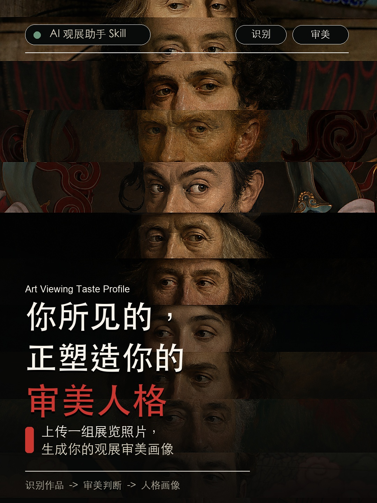
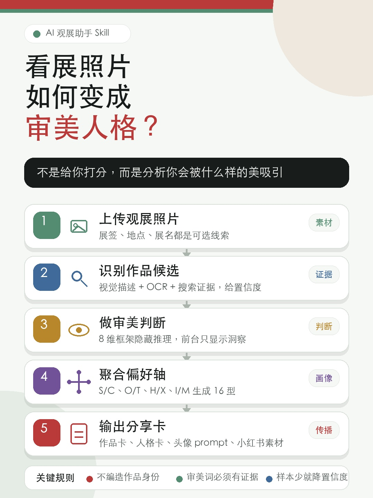

# Art Viewing Taste Profile / 观展审美画像

> 你所见的，正塑造你的审美人格。

Art Viewing Taste Profile is an agent-agnostic Skill that turns art-viewing photos into artwork recognition, evidence-backed aesthetic judgments, and a shareable 4-axis / 16-type taste profile.

它不是“给用户审美打分”的人格测试，而是把看展时拍下的照片视为观看选择的痕迹：你停下来、构图、保存、想记住的作品，正在暴露你会被什么样的美吸引。



## What It Solves

看完展后，很多人的相册里会留下大量作品照片、局部细节、展签、装置现场和重复照片。问题通常不是“没有拍下来”，而是：

- 之后很难知道每张图对应哪件作品；
- 作品身份识别容易幻觉，尤其是没有展签或只拍局部时；
- 普通整理工具只能分类照片，不能解释“为什么这些作品吸引我”；
- 社交分享往往停留在好看/震撼/喜欢，缺少更具体的审美语言。

这个 Skill 的目标是把散乱的观展照片整理成三个层次：

1. `ArtworkRecord`: 作品识别、候选、证据、置信度和用户修正。
2. `AestheticJudgment`: 基于可见证据的审美判断，而不是空泛形容词。
3. `AestheticPersonality`: 聚合多件作品后生成 4 轴 / 16 型审美画像。

## Core Workflow



1. **Collect art-viewing photos**: museum, gallery, biennale, art fair, studio, public art, or other viewing contexts.
2. **Recognize artworks**: produce visual descriptions, candidates, evidence, confidence, and safe fallback to `unidentified`.
3. **Judge aesthetics**: use an 8-dimension aesthetic framework as hidden reasoning, then show concise frontstage insights.
4. **Generate taste profile**: aggregate judgments into S/C, O/T, H/X, I/M axes and one 4-letter type.
5. **Prepare share assets**: generate card copy, portrait prompts, and social posting materials when needed.

## Aesthetic Personality Axes

| Axis | Left | Right | Meaning |
| --- | --- | --- | --- |
| 1 | `S` Sensuous / 感性直觉 | `C` Conceptual / 观念解释 | 更容易从感官、身体进入，还是从观念、历史进入 |
| 2 | `O` Ordered / 秩序平衡 | `T` Tensional / 张力冲突 | 偏好稳定秩序，还是冲突、断裂和暧昧 |
| 3 | `H` Heritage / 历史谱系 | `X` eXperimental / 实验越界 | 偏向传统谱系，还是媒介和类型越界 |
| 4 | `I` Intimate / 私密内向 | `M` Monumental / 崇高公共 | 偏向亲密、局部、身体，还是公共、宏大、纪念性 |

The full 16-type system lives in [`art-viewing-taste-profile/references/personality-system.md`](art-viewing-taste-profile/references/personality-system.md).

## Repository Structure

```text
.
├── README.md
├── assets/
│   └── social/
│       ├── xhs-cover-art-viewing-eyes-v1.jpg
│       └── art-viewing-skill-flowchart-readable-v2.jpg
├── docs/
│   └── competition-entry.md
└── art-viewing-taste-profile/
    ├── SKILL.md
    ├── agents/
    │   └── openai.yaml
    └── references/
        ├── recognition-workflow.md
        ├── aesthetic-judgment-adapter.md
        ├── personality-system.md
        ├── personality-visual-system.md
        ├── skill-flowchart.md
        └── xiaohongshu-assets.md
```

## How To Use

Use the Skill when the user provides exhibition or art-viewing photos and asks for:

- artwork recognition;
- exhibition photo organization;
- aesthetic judgment;
- 审美人格 / 审美画像;
- shareable artwork cards or Xiaohongshu assets.

Suggested prompt:

```text
Use $art-viewing-taste-profile to analyze these exhibition photos.
Please identify likely artworks with confidence, produce concise aesthetic judgments,
and generate my art-viewing taste profile if there are enough images.
```

## Quality Rules

- Do not invent artwork identity, artist, year, collection, or source URL.
- Use `probable`, `confirmed`, `unidentified`, or `user_edited` to keep recognition status honest.
- Every aesthetic word must point back to visible evidence.
- Do not rank the user's taste as high or low.
- If fewer than 5 artworks are available, mark personality confidence as medium or low.

## Competition Notes

This repository is also prepared as a competition-facing project artifact. See [`docs/competition-entry.md`](docs/competition-entry.md) for the product framing, technical path, MVP scope, risks, and iteration plan.

## Current Status

This is a Skill-first prototype, not a full production app yet. The strongest current value is the reusable workflow: artwork recognition guardrails, evidence-based aesthetic judgment, and taste-profile generation. The next engineering step would be a lightweight web app for photo upload, review/edit, and card export.
