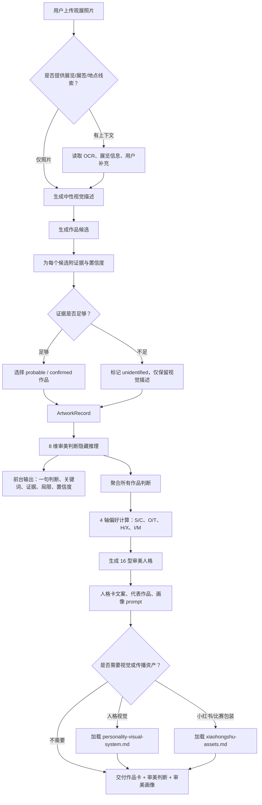
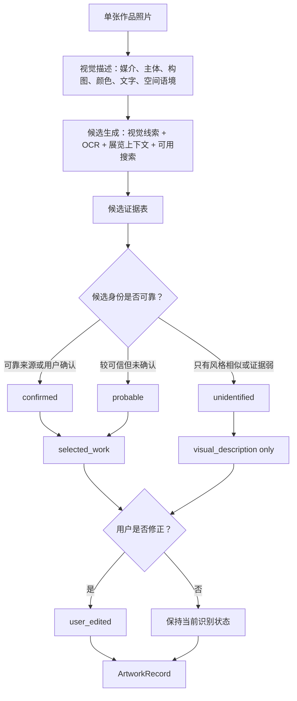
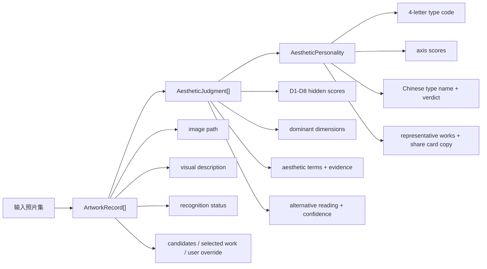

# Skill Flowchart

Use this file when explaining, pitching, or implementing the Art Viewing Taste Profile Skill as an agent workflow or product flow.

## Main Workflow

## Recognition Subflow

## Output Data Structure

## Product Notes

| Step | Product meaning | Key risk |
| --- | --- | --- |
| 作品识别 | 把凌乱相册变成可解释作品卡 | 识别幻觉，尤其是无展签、局部图、装置/影像作品 |
| 审美判断 | 把作品从“叫什么”推进到“为什么吸引你” | 审美词空泛，证据不能回到可观察细节 |
| 人格聚合 | 从单件作品判断上升到用户偏好结构 | 样本过少时结论过度确定 |
| 视觉/传播包装 | 把分析结果变成可分享的卡片和招募素材 | 包装压过核心能力，变成泛泛人格测试 |

## MVP Cut

1. MVP 1: only support photo upload, visual description, candidate recognition, and editable `ArtworkRecord`.
2. MVP 2: add concise aesthetic judgment cards with visible evidence and confidence.
3. MVP 3: aggregate at least 5 artworks into a 4-axis / 16-type taste profile.
4. MVP 4: generate share card copy, portrait prompt, and Xiaohongshu cover/recording assets.
